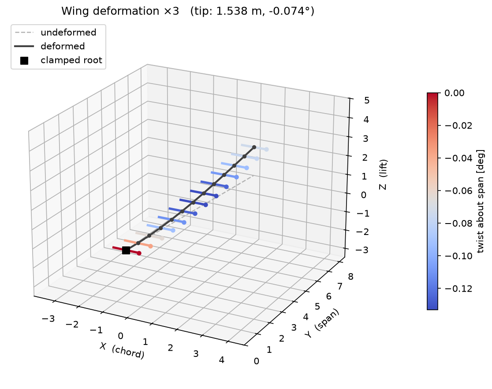
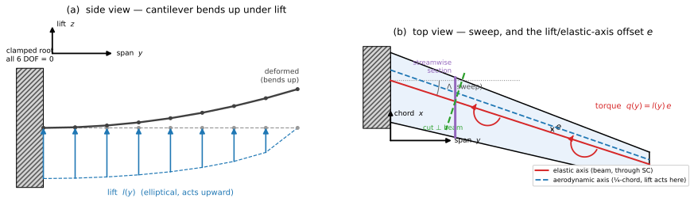
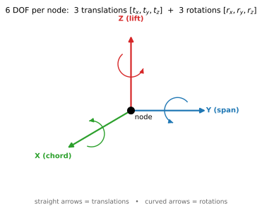
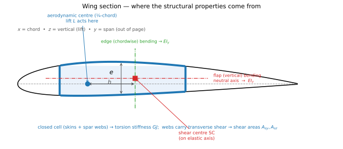

# WingBox

**A minimal 3D finite-element solver for a cantilevered wing.**

WingBox idealises a wing as a slender **beam** running along the span, clamped at
the root, and loaded by a spanwise **lift distribution** $l(y)$ and **torsion
distribution** $q(y)$. It returns the wing's deflection, twist, and the
reactions at the root. It is written for clarity — the whole solver is a few
hundred lines — and is meant as a transparent tool for structural / aeroelastic
back-of-the-envelope work.



*The figure above is the actual program output for the bundled example: the
deformed elastic axis (bending) plus a chord "rib" at every station coloured by
the local twist (torsion).*

If you come from **flight mechanics** and lift distributions, angles of attack
and pitching moments are second nature but words like *"second moment of area"*
or *"shear centre"* are not — this README is written for you. The maths of the
finite-element method is collected in [Appendix A](#appendix-a--full-formulation)
and can be skipped on a first read.

---

## 1. The physical problem

A wing carries an air load that is mostly **lift** (perpendicular to the flight
path) distributed along the span. Because the wing is built like a beam
cantilevered off the fuselage, that lift makes it **bend up**; and because the
lift does not act exactly on the wing's *elastic axis*, it also makes the wing
**twist**. Bending and twist matter: twist changes the local angle of attack,
which changes the lift, which changes the twist — the feedback loop behind
aeroelastic **divergence**, **control reversal** and **flutter**.

WingBox computes the static half of that picture: given the structure and the
air load, how much does the wing bend and twist, and what force/moment must the
root attachment react?



**Coordinate system (the "WingBox convention").** The wing lies along the global
$Y$ axis (span). $Z$ is up (the **lift** direction) and $X$ is streamwise (the
**chord** direction). The three are labelled on every figure.

**Boundary condition.** The wing is a **cantilever**: at the root ($y=0$) all
motion is prevented — the section cannot translate or rotate. This single,
always-applied constraint is the structural equivalent of "bolted to the
fuselage".

**Loads.** Two spanwise distributions drive the wing (panel *a* and *b* above):

- **Lift $l(y)$** — force per unit span, acting up (global $Z$). The example uses
  an elliptical distribution, peaking at the root and vanishing at the tip.
- **Torsion $q(y)$** — moment per unit span about the span axis. It arises
  because the **lift acts at the aerodynamic centre** (≈ the quarter-chord) while
  the wing twists about its **elastic axis**. If those two lines are separated by
  a distance $e$, the lift exerts a pitching moment $q(y) = l(y)\,e$ about the
  structure — exactly the offset shown in panel *b*.

---

## 2. Degrees of freedom

The beam is described by a chain of **nodes** along the elastic axis. At each
node the section can do six independent things — it has **6 degrees of freedom
(DOF)**: it can translate along each axis and rotate about each axis.



$$
\mathbf q_{\text{node}} = \big[\underbrace{t_x,\;t_y,\;t_z}_{\text{translations}},\;
\underbrace{r_x,\;r_y,\;r_z}_{\text{rotations}}\big]
$$

In the WingBox convention these carry direct physical meaning:

| DOF | Meaning | Governed by |
|-----|---------|-------------|
| $t_z$ | **vertical deflection** (the wing bending up) | flap bending $EI_z$ |
| $r_y$ | **twist** about the span (change of incidence) | torsion $GJ$ |
| $t_x$ | chordwise (fore–aft) deflection | edge bending $EI_y$ |
| $t_y$ | spanwise stretch | axial $EA$ |
| $r_x,\,r_z$ | bending **slopes** | $EI_z$, $EI_y$ |

Everything is coupled through one $6\times6$ stiffness relation per node, so a
single run gives bending, twist, axial stretch and their reactions together.

---

## 3. Reading a wing section: where the numbers come from

The solver never sees the airfoil shape or the internal ribs and spars. All of
that is condensed into a handful of **section properties** at each station —
numbers that summarise "how stiff is the section, and about what point". The
figure below shows where each one comes from on a real wing box.



### Elastic centre (EC) / elastic axis
The **elastic centre** (a.k.a. *shear centre*) is the point of the section where
a transverse load causes **bending without twist**. Push the wing there and it
just bends; push it anywhere else and it also rotates. The line of ECs along the
span is the **elastic axis** — the axis the wing twists about. WingBox places its
**nodes on the elastic centres** (the `EC` field in the model), so bending and
torsion decouple cleanly and the torsion input $q(y)$ is simply lift × offset.

### Second moments of area $I_y,\,I_z$  →  bending stiffness $EI$
The **second moment of area** $I$ (units m⁴) measures how far the load-carrying
material sits from the bending axis: material high above and below a bending axis
resists that bending strongly. It enters as the **bending stiffness** $EI$ in

$$
\text{bending moment} = EI \times \text{curvature}.
$$

Bigger $EI$ ⇒ less deflection. A wing has **two** of them:

- $I_z$ — **flap (vertical) bending**, resisting the lift-driven up-bending.
  Set mainly by the **structural height** $h$ of the box (the spar-cap
  separation). This is the one that matters most for tip deflection.
- $I_y$ — **edge (chordwise) bending**, resisting fore–aft loads. Set by the
  **chord width**, so usually $I_y \gg I_z$.

(The subscript follows the axis the section rotation is taken about; see the
appendix. On the section figure they are the two dash-dot neutral axes.)

### Torsion constant $J$  →  torsional stiffness $GJ$
$J$ (units m⁴) plays the same role for twisting that $I$ plays for bending:

$$
\text{torque} = GJ \times \text{twist rate}.
$$

For a wing the load-carrying structure is a **closed cell** (upper/lower skins +
front/rear spar webs), which is torsionally very efficient; $J$ follows the
thin-walled *Bredt* formula $J = 4A_m^2 / \oint \mathrm{d}s/t$ where $A_m$ is the
enclosed area. $GJ$ sets how much the wing washes in/out under the aerodynamic
pitching moment — the key quantity for divergence.

### Area $A$  →  axial stiffness $EA$
The plain cross-sectional area, giving the spanwise stretch/compression
stiffness $EA$. Minor for a wing in bending, included for completeness.

### Shear areas $A_{sy},\,A_{sz}$  →  transverse-shear stiffness
A beam deflects not only by bending but also by **transverse shear** — the webs
sliding like a stack of cards. Only part of the section effectively carries that
shear, so we use an **effective shear area** $A_s = k\,A$ with a *shear
correction factor* $k$ (≈ 5/6 for a solid section, ≈ 1/2 for a thin box). This
is what makes the model a **Timoshenko** beam rather than the simpler
**Euler–Bernoulli** beam (which ignores shear entirely). For slender wings the
shear contribution is small, but it is included so short/stubby sections are also
handled correctly.

### Material $E,\,\nu$
Isotropic elastic material: **Young's modulus** $E$ (stiffness) and **Poisson's
ratio** $\nu$, which together give the **shear modulus** $G = E/[2(1+\nu)]$.
Aluminium is $E\approx 71$ GPa, $\nu\approx0.33$.

### Summary

| Symbol | Property | Stiffness it creates | Aeroelastic role |
|--------|----------|----------------------|------------------|
| `EC` | elastic centre position | — | axis of twist; sets the lift offset $e$ |
| $I_z$ | flap second moment of area | $EI_z$ bending | wing bending / tip deflection |
| $I_y$ | edge second moment of area | $EI_y$ bending | chordwise / in-plane bending |
| $J$ | torsion constant | $GJ$ torsion | twist, divergence, control effectiveness |
| $A$ | area | $EA$ axial | spanwise stretch |
| $A_{sy},A_{sz}$ | shear areas | transverse shear | shear-flexibility (short beams) |
| $E,\nu$ | material | $E$, $G$ | overall stiffness scaling |

---

## 4. How the solver works (the finite-element idea in one page)

The wing is a continuous beam, but we solve it on a computer by chopping it into
a finite number of **elements** joined at nodes — the *finite element method*.

1. **Discretise.** The span is split into 3-node **quadratic elements** (each
   element spans three consecutive stations). "Quadratic" means the deflection
   and twist are allowed to vary as a parabola within each element — accurate
   enough that even a coarse mesh is essentially exact for beams.
2. **Element stiffness.** For each element we build an $18\times18$ matrix
   $\mathbf K^e$ (6 DOF × 3 nodes) that relates the nodal displacements to the
   nodal forces, using the section properties above.
3. **Assemble.** The element matrices are added into one global stiffness matrix
   $\mathbf K$ for the whole wing, and the distributed loads $l(y),q(y)$ are
   converted into equivalent nodal forces $\mathbf F$ (a *consistent load
   vector*).
4. **Apply the clamp.** The six root DOF are fixed at zero.
5. **Solve** the linear system $\mathbf K\,\mathbf u = \mathbf F$ for the nodal
   displacements $\mathbf u$, then recover the **root reactions** as
   $\mathbf K\mathbf u - \mathbf F$ at the clamped DOF.

Because this is a 1-D problem solved with a consistent load vector, the nodal
answers are **exact** — verified to machine precision against the textbook
Timoshenko cantilever formulas (see [§8](#8-verification)). The full derivation
(kinematics, weak form, shape functions, shear-locking cure) is in
[Appendix A](#appendix-a--full-formulation).

---

## 5. Quick start

Requires [`uv`](https://docs.astral.sh/uv/) (it manages the Python version and
the `numpy` / `scipy` / `matplotlib` dependencies).

```bash
uv run main.py          # solve the bundled PC-24-like wing and plot it
```

```python
import numpy as np
from wingbox import solve_wing, plot_deformation, load_stations

sol = solve_wing("wings/pc24_wing_sections.json", "wings/pc24_loads.json")

print("tip deflection [m] :", sol.displacements[-1, 2])     # vertical (lift dir.)
print("tip twist [deg]    :", np.degrees(sol.rotations[-1, 1]))
print("root reaction force :", sol.root_force)              # [Fx, Fy, Fz]
print("root reaction moment:", sol.root_moment)             # [Mx, My, Mz]

coords = np.array([s["EC"] for s in load_stations("wings/pc24_wing_sections.json")])
plot_deformation(coords, sol, scale=3.0)                    # 3D view (window)
```

`solve_wing` returns a `Solution` holding **only** the results of interest, in
global axes:

| field | shape | meaning |
|-------|-------|---------|
| `sol.displacements` | (n, 3) | nodal translations $[t_x,t_y,t_z]$ |
| `sol.rotations` | (n, 3) | nodal rotations $[r_x,r_y,r_z]$ |
| `sol.root_force` | (3,) | reaction force $[F_x,F_y,F_z]$ at the clamp |
| `sol.root_moment` | (3,) | reaction moment $[M_x,M_y,M_z]$ at the clamp |

The plot shows the **bending** (deformed elastic axis) and the **torsion**
(chord ribs tilted about the span axis, coloured by local twist); bending and
twist share one `scale` factor, so nothing is exaggerated.

---

## 6. Defining a wing

### Sections — `wings/*_wing_sections.json`

A wing is a list of **stations** along the span. Each station gives the elastic
centre `EC` (its 3-D position) and the section properties there. Properties may
**taper** from station to station.

```json
{
  "Wingsection": {
    "station1": {
      "EC": [0.0, 0.0, 0.0],
      "E": 71.0e9, "nu": 0.33,
      "A": 0.01716, "Iy": 0.00263177, "Iz": 0.00029243, "J": 0.00087008,
      "ky": 0.5, "kz": 0.5
    },
    "station2": { "EC": [0.062, 0.708, 0.0], "...": "..." },
    "station3": { "EC": [0.124, 1.417, 0.0], "...": "..." }
  }
}
```

Use an **odd number of stations** ($n = 2n_e + 1$): each quadratic element uses
three of them. Stations are ordered by the trailing integer in their name.
See [`wings/pc24_wing_sections.json`](wings/pc24_wing_sections.json).

### Loads — `wings/*_loads.json`

The lift $l(y)$ and torsion $q(y)$ are each tabulated at a handful of spanwise
points and **linearly interpolated** in between (clamped to the end values
outside the range):

```json
{
  "Loads": {
    "y": [0.0, 2.125, 4.25, 6.375, 8.5],
    "l": [15245.7, 14761.6, 13203.2, 10084.1, 0.0],
    "q": [2286.9, 2214.2, 1980.5, 1512.6, 0.0]
  }
}
```

See [`wings/pc24_loads.json`](wings/pc24_loads.json).

---

## 7. Bundled example — a PC-24-like wing

The example approximates the semi-wing of a light business jet
(Pilatus PC-24-class): **8.5 m** semi-span, **5° sweep**, a tapered aluminium
wing box, discretised with **13 stations → 6 elements**. The load is an
**elliptical lift** distribution sized to a **2.5 g limit manoeuvre**
(≈ 102 kN per semi-wing) with a torsion distribution from a ~0.15 m aerodynamic-
to-elastic-axis offset. Running it:

```
Tip vertical deflection (global Z): 0.5126 m   (≈ 6% of semi-span)
Tip twist (about global Y):         -0.0738 deg
Root reaction force  [N]:   [      0.        0.  -100446.6]
Root reaction moment [N.m]: [-355617.3   16044.9        0. ]
```

The vertical reaction (≈ 100 kN down) balances the applied lift, and the root
bending moment (≈ 356 kN·m) equals $\int l(y)\,y\,\mathrm{d}y$ — sanity checks a
flight-mechanics reader can verify by hand.

> The section properties here are reasonable engineering estimates of a wing box,
> not PC-24 certification data (which is not public). The diagrams in this README
> are regenerated by [`docs/make_figures.py`](docs/make_figures.py).

---

## 8. Verification

The element and the solver reproduce closed-form results exactly:

| Test | Reference | Error |
|------|-----------|-------|
| Tip deflection, tip transverse load | Timoshenko $\dfrac{PL^3}{3EI} + \dfrac{PL}{GA_s}$ | $0.000\%$ |
| Axial extension | $\dfrac{PL}{EA}$ | $0.000\%$ |
| Uniform lift, distributed | $\dfrac{wL^4}{8EI} + \dfrac{wL^2}{2GA_s}$ | $0.000\%$ (any mesh) |
| Uniform torsion, distributed | $\dfrac{tL^2}{2GJ}$ | $0.000\%$ (any mesh) |
| Rigid-body modes (free element) | exactly 6 | ✓ no spurious mode |

---

## 9. Project layout

```
wingbox/
  stations.py   Section (material + geometry) and the wing-JSON loader
  loads.py      Loads: interpolated l(y), q(y) from the load-JSON
  element.py    3-node quadratic Timoshenko beam element (18x18 stiffness)
  assemble.py   mesh -> global K, consistent F, clamp root, solve -> Solution
  plot.py       3D bending + twist visualisation
wings/          example wing + load JSON files
docs/           README figures and the script that makes them
main.py         end-to-end demo
```

---

# Appendix A — full formulation

The wing is discretised with **1D, 3-node quadratic (second-order Lagrange)
Timoshenko beam elements** with **6 DOF per node**. This appendix gives the
complete derivation for reference.

## A.1 Element and local frame

Each node $i$ carries six DOF in the element's **local** frame,

$$
\mathbf{q}_i = \big[\, u,\; v,\; w,\; r_x,\; r_y,\; r_z \,\big]^{\mathsf T},
$$

three translations $(u, v, w)$ along the local axes $(x, y, z)$ and three
rotations $(r_x, r_y, r_z)$ about them. The local $x$-axis runs along the beam;
$y$ and $z$ are the cross-section principal axes. An element has three nodes —
`[end1, mid, end2]` — so **18 DOF per element**. All six fields use the **same**
quadratic Lagrange shape functions (equal-order interpolation), which is why the
transverse-shear terms need special integration (§A.7).

## A.2 Kinematics (Timoshenko assumptions)

Plane cross-sections remain plane but **not necessarily normal** to the beam
axis — the extra freedom over Euler–Bernoulli theory is transverse shear.
Treating each section as rigid in its own plane, a point at $(y, z)$ displaces as

$$
\begin{aligned}
u_x(x,y,z) &= u(x) + z\, r_y(x) - y\, r_z(x), \\
u_y(x,y,z) &= v(x) - z\, r_x(x), \\
u_z(x,y,z) &= w(x) + y\, r_x(x).
\end{aligned}
$$

The rotations $r_y, r_z$ are **independent** of the slopes $w', v'$ (the
Timoshenko hypothesis); $r_x$ is the St. Venant torsional twist.

## A.3 Generalized strains (kinematic relations)

With $(\,\cdot\,)' = \mathrm{d}(\cdot)/\mathrm{d}x$:

$$
\boldsymbol{\varepsilon} =
\begin{bmatrix}
\varepsilon_x \\ \kappa_x \\ \kappa_y \\ \kappa_z \\ \gamma_{xy} \\ \gamma_{xz}
\end{bmatrix}
=
\begin{bmatrix}
u' \\[2pt] r_x' \\[2pt] r_y' \\[2pt] r_z' \\[2pt] v' - r_z \\[2pt] w' + r_y
\end{bmatrix}
\begin{array}{l}
\quad\text{axial strain} \\
\quad\text{torsional twist rate} \\
\quad\text{bending curvature (local }x\text{-}z\text{ plane)} \\
\quad\text{bending curvature (local }x\text{-}y\text{ plane)} \\
\quad\text{transverse shear, local }y \\
\quad\text{transverse shear, local }z
\end{array}
$$

The shear strains $\gamma_{xy} = v' - r_z$, $\gamma_{xz} = w' + r_y$ are the
**mismatch between the deflection slope and the section rotation**; they vanish
in Euler–Bernoulli theory, where $r_z \equiv v'$ and $r_y \equiv -w'$.

## A.4 Constitutive relations

The section resultants — axial force $N$, torque $T$, bending moments $M_y,M_z$,
shear forces $V_y,V_z$ — follow a **diagonal** law
$\boldsymbol{\sigma} = \mathbf{D}\,\boldsymbol{\varepsilon}$:

$$
\begin{bmatrix} N \\ T \\ M_y \\ M_z \\ V_y \\ V_z \end{bmatrix}
=
\underbrace{
\begin{bmatrix}
EA \\ & GJ \\ & & EI_y \\ & & & EI_z \\ & & & & G A_{sy} \\ & & & & & G A_{sz}
\end{bmatrix}}_{\mathbf{D}}
\begin{bmatrix} \varepsilon_x \\ \kappa_x \\ \kappa_y \\ \kappa_z \\ \gamma_{xy} \\ \gamma_{xz} \end{bmatrix}
$$

with $G = E/[2(1+\nu)]$ and effective shear areas $A_{sy}=k_yA$, $A_{sz}=k_zA$.

## A.5 Strong form (beam equilibrium)

With distributed loads $\mathbf{f} = [f_x, f_y, f_z, m_x, m_y, m_z]$ per unit
length:

$$
\begin{aligned}
\text{axial:} && (EA\,u')' + f_x &= 0, \\
\text{torsion:} && (GJ\,r_x')' + m_x &= 0, \\[4pt]
\text{bending } x\text{-}y: &&
\big(G A_{sy}(v' - r_z)\big)' + f_y &= 0, \\
&& (EI_z\, r_z')' + G A_{sy}(v' - r_z) + m_z &= 0, \\[4pt]
\text{bending } x\text{-}z: &&
\big(G A_{sz}(w' + r_y)\big)' + f_z &= 0, \\
&& (EI_y\, r_y')' - G A_{sz}(w' + r_y) + m_y &= 0.
\end{aligned}
$$

For a cantilever the essential BC clamps all six DOF at the root,
$\mathbf{q}(0)=\mathbf 0$; the natural BCs prescribe end forces/moments.

In WingBox the applied loads map as $f_z = l(y)$ (lift, global $Z$) and
$m_y = q(y)$ (torsion, about global $Y$).

## A.6 Weak (variational) form

Multiplying by a virtual displacement $\delta\mathbf d$ (with
$\delta\mathbf d(0)=\mathbf 0$) and integrating by parts over $[0,L]$ gives the
principle of virtual work

$$
\underbrace{\int_0^L \delta\boldsymbol{\varepsilon}^{\mathsf T}\,
\mathbf{D}\,\boldsymbol{\varepsilon}\;\mathrm{d}x}_{\text{internal}}
=
\underbrace{\int_0^L \delta\mathbf{d}^{\mathsf T}\,\mathbf{f}\;\mathrm{d}x
+ \big[\,\delta\mathbf{d}^{\mathsf T}\,\bar{\mathbf t}\,\big]_{\partial}}_{\text{external}}
\qquad \forall\,\delta\mathbf{d}.
$$

Trial/test fields need only be $C^0$-continuous — exactly what Lagrange shape
functions provide.

## A.7 Finite element discretization

**Shape functions** on $\xi\in[-1,1]$, nodes at $\xi=-1,0,+1$:

$$
N_1 = \tfrac12\,\xi(\xi-1), \qquad N_2 = 1 - \xi^2, \qquad N_3 = \tfrac12\,\xi(\xi+1),
$$

with constant Jacobian $J = \mathrm{d}x/\mathrm{d}\xi = L/2$ and
$\mathrm{d}N_i/\mathrm{d}x = (1/J)\,\mathrm{d}N_i/\mathrm{d}\xi$.

**Strain–displacement matrix.** With $\boldsymbol\varepsilon = \mathbf B\,\mathbf q^e$,
the block for node $i$ (local columns $6i,\dots,6i+5$) is

$$
\mathbf{B}_i =
\begin{bmatrix}
N_i' & 0 & 0 & 0 & 0 & 0 \\
0 & 0 & 0 & N_i' & 0 & 0 \\
0 & 0 & 0 & 0 & N_i' & 0 \\
0 & 0 & 0 & 0 & 0 & N_i' \\
0 & N_i' & 0 & 0 & 0 & -N_i \\
0 & 0 & N_i' & 0 & N_i & 0
\end{bmatrix},
\qquad N_i' \equiv \frac{\mathrm{d}N_i}{\mathrm{d}x}.
$$

The two shear rows mix a derivative term ($N_i'$) with an interpolation term
($N_i$) — the source of shear locking.

**Element stiffness:**

$$
\mathbf{K}^e_{\text{loc}} = \int_0^L \mathbf{B}^{\mathsf T}\,\mathbf{D}\,\mathbf{B}\;\mathrm{d}x
\;\approx\; \sum_{g} \mathbf{B}(\xi_g)^{\mathsf T}\,\mathbf{D}\,\mathbf{B}(\xi_g)\, w_g\, J .
$$

## A.8 Selective reduced integration

Equal-order interpolation makes the element **over-stiff in shear** for slender
beams (*shear locking*): $\gamma_{xy}=v'-r_z$ cannot vanish everywhere because
$v'$ is linear while $r_z$ is quadratic. The cure is **selective reduced
integration** — split $\mathbf D$ and integrate each part with its own
Gauss–Legendre rule:

$$
\mathbf{K}^e_{\text{loc}}
= \underbrace{\int \mathbf{B}^{\mathsf T} \mathbf{D}_{\text{bend}}\, \mathbf{B}\;\mathrm{d}x}_{\text{3-point (full)}}
+ \underbrace{\int \mathbf{B}^{\mathsf T} \mathbf{D}_{\text{shear}}\, \mathbf{B}\;\mathrm{d}x}_{\text{2-point (reduced)}}
$$

with $\mathbf{D}_{\text{bend}} = \mathrm{diag}(EA, GJ, EI_y, EI_z, 0, 0)$ and
$\mathbf{D}_{\text{shear}} = \mathrm{diag}(0,0,0,0,GA_{sy},GA_{sz})$. This yields
exactly **6 rigid-body modes and no spurious mechanism**.

## A.9 Coordinate transformation

Let $\mathbf R$ have the local axes (as rows) in global coordinates, so
$\mathbf v_{\text{loc}} = \mathbf R\,\mathbf v_{\text{glob}}$. It is built from
the beam axis $\mathbf e_x$ (end1→end2) and a reference vector
$\mathbf v_{\text{ref}}$ (default global $Z$) by Gram–Schmidt:

$$
\mathbf{e}_x = \frac{\mathbf{x}_3 - \mathbf{x}_1}{\lVert \mathbf{x}_3 - \mathbf{x}_1 \rVert},
\quad
\mathbf{e}_y = \frac{\mathbf{v}_{\text{ref}} - (\mathbf{v}_{\text{ref}}\!\cdot\!\mathbf{e}_x)\,\mathbf{e}_x}
                    {\lVert \cdots \rVert},
\quad
\mathbf{e}_z = \mathbf{e}_x \times \mathbf{e}_y .
$$

The $18\times18$ transformation $\mathbf T$ is block-diagonal with six copies of
$\mathbf R$, and $\mathbf K^e_{\text{glob}} = \mathbf T^{\mathsf T}\mathbf K^e_{\text{loc}}\mathbf T$.

**WingBox convention.** For a wing along global $Y$ with
$\mathbf v_{\text{ref}} = Z$:

$$
\text{local } x = \text{global } Y \;(\text{span}),\quad
\text{local } y = \text{global } Z \;(\text{lift}),\quad
\text{local } z = \text{global } X \;(\text{chord}),
$$

so flap (lift-direction) bending is governed by $I_z$ and chordwise bending by
$I_y$.

## A.10 Assembly, loads and solution

With $n = 2n_e + 1$ stations, element $e$ owns nodes $[2e,\,2e{+}1,\,2e{+}2]$
(end nodes shared) and takes a constant `Section` from its mid station
(piecewise-constant along a taper). Element stiffnesses scatter into the global
$6n\times6n$ matrix $\mathbf K$. The distributed loads become a **consistent
nodal load vector** through the shape functions,

$$
F_i = \int N_i(y)\, l(y)\,\mathrm{d}y \ \text{(global-}Z\text{ DOF)}, \qquad
F_i = \int N_i(y)\, q(y)\,\mathrm{d}y \ \text{(global-}Y\text{ rotation DOF)},
$$

evaluated by Gauss quadrature with an isoparametric map to the physical span.
The root DOF are fixed and the reduced system
$\mathbf K_{ff}\mathbf u_f = \mathbf F_f$ is solved; the root reaction is
$\mathbf R = (\mathbf K\mathbf u - \mathbf F)$ at the clamped DOF.
